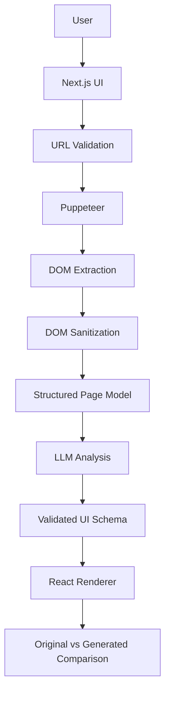

# AI Page Rebuilder

An experimental AI-powered developer tool that analyzes public webpages and reconstructs their visual structure as reusable React components using browser automation, structured DOM extraction, LLM reasoning, and schema-driven rendering.

## Demo

Run the app and select **Try the interactive demo**. Sample mode walks through the full processing pipeline and opens a complete original-versus-generated comparison without visiting an external site or requiring an API key.

## Screenshots

The repository ships demo data rather than checked-in binary screenshots. The home screen and comparison workspace are available immediately in sample mode; live analysis captures the target page at 1440 × 900.

## Why I Built This

Page recreation is an interesting systems problem: browser automation, lossy DOM reduction, visual reasoning, output validation, and safe rendering all have to work together. This project explores that pipeline without copying source code or treating model output as trusted executable code.

## Architecture



Responsibilities are deliberately separated across `lib/security`, `lib/browser`, `lib/ai`, and `lib/renderer`. The API route orchestrates those services but does not contain extraction or prompt logic.

## How It Works

1. The server validates the submitted public HTTP(S) URL and resolves its hostname.
2. Puppeteer opens the page with a bounded viewport, timeout, redirect limit, and response-size check.
3. A page-context extractor captures visible elements, direct text, selected attributes, computed visual styles, and geometry—not raw HTML.
4. The sanitizer removes blocked/hidden nodes, unapproved attributes and styles, long strings, and nodes beyond depth/count limits.
5. A deterministic converter maps the sanitized rendered DOM into the controlled UI schema, preserving visible hierarchy and approved computed styles.
6. Optional AI refinement receives the page model and screenshot, but replaces the baseline only when text, image, and component-coverage checks pass.
7. Zod validates model output before the controlled React renderer handles it.
8. The UI presents the page screenshot and recreation side by side, with analysis metrics and focused-view toggles.

## AI Pipeline

The provider boundary is defined in `lib/ai/provider.ts`. The deterministic browser-derived schema is the fidelity baseline. `OpenAICompatibleProvider` can optionally refine that structure using both the screenshot and page model; sparse refinements are rejected. This makes live URL reconstruction work without an API key by default while preserving an opt-in AI pipeline.

## Prompt Engineering

Prompts live in `lib/ai/prompts/pageAnalysis.ts`. The system prompt treats page strings as untrusted data, permits only known component types, prohibits code/HTML/event handlers, asks the model not to invent content, and emphasizes responsive layout relationships. The task prompt serializes only the sanitized page model.

## Security

- Accepts only `http:` and `https:` URLs without embedded credentials.
- Rejects localhost/internal hostnames, IPv4 and IPv6 loopback, private, link-local, carrier-grade NAT, multicast, and reserved ranges.
- Checks DNS answers before navigation and validates the final URL after redirects to reduce DNS-rebinding and redirect-based SSRF risk.
- Limits redirects, navigation time, content length, extracted nodes, tree depth, text length, attributes, and style fields.
- Never sends raw unlimited HTML to the model.
- Never uses `eval`, injects model HTML, or executes model-authored JavaScript. Model output becomes data for a fixed React component registry.
- Keeps API credentials in server environment variables.

For a hardened multi-tenant production deployment, also isolate Chromium at the network layer, route egress through a filtering proxy, revalidate every subresource/redirect hop, add quotas, and enforce process-level resource limits.

## Tech Stack

Next.js 15, React 19, TypeScript, Tailwind CSS, Puppeteer, an OpenAI-compatible HTTP provider, Zod, Vitest, and Lucide icons.

## Getting Started

Requirements: Node.js 20+ and npm.

```bash
npm install
cp .env.example .env.local
npm run dev
```

Open [http://localhost:3000](http://localhost:3000). Sample mode needs no environment values. For live analysis, configure an AI provider and ensure Puppeteer's Chromium can launch on your platform.

## Environment Variables

| Variable | Required | Description |
| --- | --- | --- |
| `AI_API_KEY` | Live mode | Server-side provider credential |
| `AI_BASE_URL` | No | OpenAI-compatible API base; defaults to OpenAI |
| `AI_MODEL` | No | Model identifier; defaults to `gpt-4o-mini` |
| `AI_REFINEMENT_ENABLED` | No | Set to `true` to permit fidelity-checked multimodal AI refinement; defaults to `false` |
| `PUPPETEER_EXECUTABLE_PATH` | No | Path to a system Chrome/Chromium binary |

Never expose these through a `NEXT_PUBLIC_` variable.

## Testing

```bash
npm test
npm run lint
npm run build
```

Unit tests cover private-address detection, DOM sanitization/limits, and strict parsing of AI output.

## Project Structure

```text
app/                  Next.js pages, styling, and analyze API
components/           Input, processing, comparison, and schema renderer UI
lib/ai/               Provider abstraction, prompts, and Zod schemas
lib/browser/          Puppeteer extraction and DOM sanitization
lib/demo/             Local pre-generated sample result
lib/renderer/         Approved style filtering
lib/security/         URL and resolved-address validation
tests/                Focused unit tests
types/                Shared pipeline contracts
```

## Design Decisions

### Why a validated UI schema?

Models are excellent at hierarchy and visual approximation, but their output is untrusted. Executing generated React or JavaScript would introduce injection, dependency, and server-execution risks. A schema preserves useful model reasoning while Zod rejects unknown structures and a fixed registry decides exactly what can render. This also makes output deterministic to test, inspect, persist, and migrate.

### Why direct text and selected computed styles?

Raw HTML is noisy, large, legally awkward to store, and full of scripts and irrelevant implementation detail. Direct visible text plus a small visual vocabulary captures what reconstruction needs while sharply reducing tokens and prompt-injection surface.

## Limitations

- Screenshot comparison covers the initial 1440 × 900 viewport rather than a full responsive test matrix.
- Highly animated, canvas/WebGL, video-heavy, authenticated, CAPTCHA-protected, or bot-blocking pages may not analyze correctly.
- `content-length` is not always provided; strict streamed byte accounting and subresource budgets would be needed for stronger page-size enforcement.
- Visual fidelity depends on the model and on how much of a design is expressed through visible DOM.
- Remote images are rendered only from HTTP(S) URLs; no assets are downloaded into the repository.

## Future Improvements

1. Add an egress-filtering browser worker with per-request CPU, memory, subresource byte, and redirect-hop policies.
2. Add responsive multi-viewport capture plus perceptual screenshot scoring to iteratively refine schemas.
3. Add an editable schema inspector with component selection, visual diff overlays, and export to a clean React component package.
